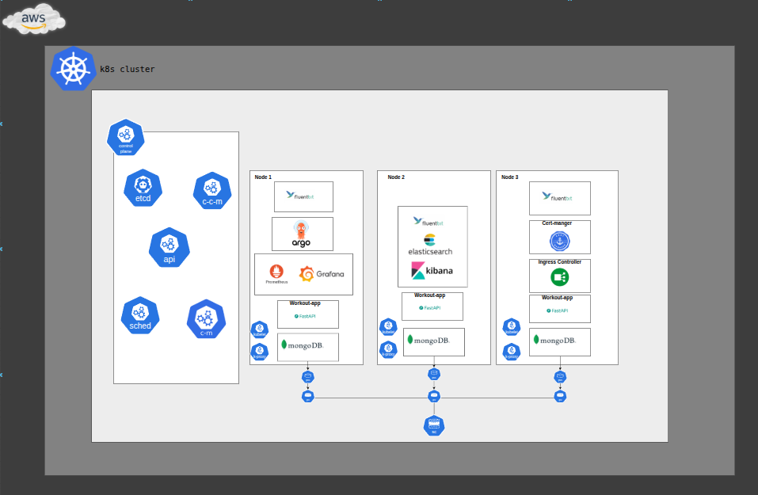

# Workout Kubernetes Charts

Helm charts that package the Workout Generator & Tracker backend, frontend, and supporting services for deployment to Kubernetes (EKS).


*High-level layout of the EKS cluster hosting the workout stack.*

## Chart Catalog

| Chart | Path | Purpose |
| --- | --- | --- |
| `workout-app` | `charts/workout-app/` | Packages the FastAPI backend deployment, service, probes, and env configuration. |
| `workout-frontend` | `charts/workout-frontend/` | Packages the React/NGINX frontend deployment and service. |
| `workout-stack` | `charts/workout-stack/` | Umbrella chart that pulls backend + frontend as dependencies and wires shared values. |

```
k8s/
└── charts/
    ├── workout-app/
    ├── workout-frontend/
    └── workout-stack/        # Use this chart for full application rollout
```

## Prerequisites

- Helm 3.8+
- Kubernetes context pointing to the target cluster (AWS EKS in production).
- `mongodb-uri` secret already provisioned (managed via SealedSecrets in `argocd/`).
- Optional: `helm-diff` plugin for previewing upgrades.

## Common Commands

Lint all charts:

```bash
helm lint charts/workout-app charts/workout-frontend charts/workout-stack
```

Render manifests locally (uses default `values.yaml`):

```bash
helm template workout charts/workout-stack --namespace workout
```

Install/upgrade the full stack:

```bash
helm upgrade --install workout-stack charts/workout-stack \
  --namespace workout --create-namespace \
  --set workout-app.image.tag=backend-vX.Y.Z \
  --set workout-frontend.image.tag=frontend-vX.Y.Z
```

Package the umbrella chart for distribution:

```bash
helm dependency update charts/workout-stack
helm package charts/workout-stack --destination ./dist
```

## Configuration Highlights

- **Images**: Set via `workout-app.image.*` and `workout-frontend.image.*` in the umbrella chart values. Jenkins updates these tags during the CI/CD pipeline.
- **Replicas & Resources**: Controlled per sub-chart (`replicaCount`, `resources.requests`, `resources.limits`).
- **Environment Variables**: Backend pulls `MONGO_URI` from the `mongodb-uri` secret and merges additional values from `workout-app.env`.
- **Probes**: Default liveness/readiness use `/health` on port 8000 for the backend and `/health` on the frontend service.

> For environment-specific configuration, create an overlay values file (e.g., `values-prod.yaml`) and pass it with `-f values-prod.yaml` during deploys.

## Release Workflow

1. Jenkins builds backend/frontend images, pushes them to ECR, and updates the umbrella values file with the new tags.
2. Changes are committed to the GitOps repo (`argocd/`), where ArgoCD detects the new chart version.
3. ArgoCD syncs the cluster using these Helm charts, resulting in rolling updates.

## Troubleshooting

- `helm get manifest workout-stack -n workout` – View the live rendered manifests.
- `kubectl describe deploy backend -n workout` – Inspect rollout status for the backend deployment.
- Ensure `helm dependency update` runs whenever `workout-stack/Chart.yaml` dependencies change.
- Missing Mongo credentials indicate the `mongodb-uri` secret has not been applied; double-check the SealedSecret in the GitOps repo.

## Related Docs

- Root `README.md` for overall architecture and pipeline.
- `argocd/README.md` for GitOps workflow and SealedSecrets management.
- `infra/README.md` for Terraform modules that provision the EKS cluster hosting these charts.
